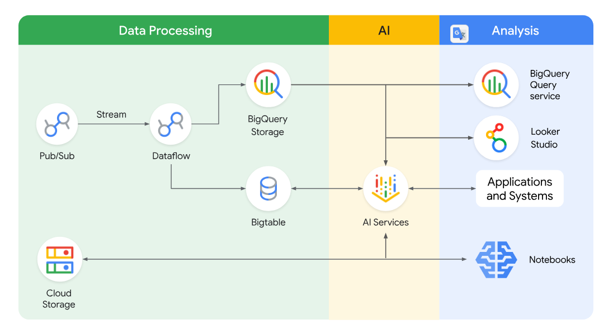

# 🌊📡 README — Streaming Data Pipelines on Google Cloud (Course Intro + Core Use Cases)

**Goal:** Learn how to **design, build, and operate streaming pipelines** that deliver **low-latency, reliable, scalable** outcomes using **Pub/Sub, Managed Service for Apache Kafka, Dataflow (Apache Beam), BigQuery, and Bigtable**.

**Read me like this:**

1. Why streaming (vs batch) → 2) Core challenges → 3) The 4 streaming “design outcomes” → 4) The 4 reference use cases + architectures → 5) Service selection cheats → 6) Exam traps + the matching question.

---

## 1) 🎯 Why streaming exists (the business reason)

Batch is “collect then process later”. Streaming is “**process as it arrives**”.

For the **Galactic Grand Prix** scenario (e-sports, ultra-fast gameplay + audience telemetry), streaming is mandatory because:

* **Every millisecond counts** (actions must be derived in ms/seconds).
* The platform must handle **massive continuous flows** (billions of events/sec).

**What you’re actually building:** pipelines that convert live events into:

* **Real-time analytics** (dashboards, monitoring)
* **Serving data for applications** (leaderboards, limits, user state)
* **Real-time AI decisions** (cheat detection, anomaly detection)
* **Activation loops** (send insights back to ops systems)

---

## 2) ⚠️ The 5 streaming challenges you must recognise (exam wording)

These are the problems streaming architectures are designed to “absorb”:

1. **High velocity & volume**
   Continuous event floods; you must avoid backlogs.

2. **Low latency requirements**
   Milliseconds/seconds, not minutes/hours.

3. **Data quality & order**
   Integrity, completeness, and *correct ordering* is harder in streams.

4. **Scalability & elasticity**
   Must auto-scale up/down (tournament spikes).

5. **Fault tolerance & durability**
   Must survive failures without losing data.

> ✅ **Exam tip:** If the question says “spiky traffic”, “must not fall behind”, “no data loss”, “sub-second”, think **streaming + managed ingestion + managed processing** (Pub/Sub/Kafka + Dataflow).

---

## 3) 🧱 The 4 outcomes of a “good” streaming pipeline

A streaming pipeline is considered “successful” if it delivers these:

### A) **Near instantaneous insights**

Sub-second (or very low) latency, enabling immediate decisions.

### B) **Freshness & relevance**

Continuously updated data (live dashboards, anti-cheat, live UX).

### C) **High-velocity ingestion**

Designed to handle sustained throughput without piling up.

### D) **Event-driven responsiveness**

Systems react to events immediately (clicks, transactions, sensor alerts).

---

## 4) 🗺️ Reference architectures you must map quickly

### 4.1 ✅ Simple Streaming ETL (minimal transforms → analytics)

**Use for:** Real-time dashboards / analytics when the events are already structured or semi-structured and “mostly usable”.

**Typical flow:**
**Pub/Sub (or Kafka) → Dataflow (minimal transform) → BigQuery → Looker / SQL**

**Galactic example:** track website clicks live to see what pages are trending.

> ✅ **Exam tip:** If they say “dashboarding”, “SQL queries immediately”, “minimal transform” → **BigQuery** as the sink.

---

### 4.2 🧪 Complex Streaming ETL (heavy transforms before analytics)

**Use for:** when events need **cleaning + joins + aggregation + schema reshaping** before they become query-ready.

**Typical flow:**
**Pub/Sub/Kafka → Dataflow (Beam) [clean/join/enrich/aggregate] → BigQuery**

**Galactic example:** transform raw game events into:

* unified schema
* enriched with player metadata (e.g., region, level)
* aggregated into session KPIs (lap time, collisions, distance per session)

> ✅ **Exam tip:** If they explicitly say “join/enrich/aggregate before loading” → **Dataflow does the heavy lifting**, not BigQuery alone.

---

### 4.3 🤖 Streaming AI/ML (features + inference in real time)

**Use for:** real-time decisions (fraud/cheat/anomaly/recommendations).

**Typical flow (course framing):**
**Pub/Sub → Dataflow → Feature Store → Vertex AI (inference)**

Key steps you must recognise:

* preprocessing (embeddings / n-grams / bucketising)
* feature enrichment (feature store)
* inference call (Vertex AI)
* action/output immediately

**Galactic example:** detect cheating patterns moments after suspicious actions.

> ✅ **Exam tip:** If they say “real-time inference”, “feature store”, “embeddings”, “model call” → **Vertex AI + Feature Store + Dataflow**.

---

### 4.4 ⚡ Streaming applications (serving layer with very low latency)

**Use for:** operational apps that need instant reads/writes of current state (leaderboards, user limits, live scores).

**Typical pattern:** streaming updates → **serving database** → apps read instantly

* **Bigtable** = low-latency wide-column serving
* **Spanner** = relational, strongly consistent serving (when needed)

**Galactic example:** live dashboards for commentators or real-time game score APIs.

> ✅ **Exam tip:** If they say “serving”, “low-latency app”, “live state”, think **Bigtable/Spanner**, not just BigQuery.

---

### 4.5 🔁 Reverse ETL (activation: analytics → operational systems)

**Use for:** pushing curated insights back into operational tools (CRM/marketing/personalisation systems).

**Typical flow:**
**BigQuery → Pub/Sub / Bigtable / Spanner → operational applications**

**Galactic example:** push “high-value viewers” or “at-risk-of-churn” segments into marketing systems for targeted offers.

> ✅ **Exam tip:** If the direction is “from warehouse to ops systems” → that is **reverse ETL**.

---

## 5) 🧠 The diagram you shared (what it’s really saying)

It’s a “three-zone” mental model:

### Data Processing

* **Pub/Sub → Dataflow (stream processing)**
* Dataflow writes to:

    * **BigQuery Storage** (analytics-ready)
    * **Bigtable** (serving-ready)
* **Cloud Storage** sits as a file/object layer (common landing, replay, offline data, notebooks input)

### AI

* **AI Services** consume data from BigQuery/Bigtable and feed results to applications (and back into pipelines).

### Analysis

* **BigQuery Query Service** + **Looker Studio** for BI/SQL analytics
* **Applications & Systems** consume outputs (scores, segments, alerts)
* **Notebooks** for exploration/DS workflows (often pulling from storage/warehouse)

---

## 6) ✅ Matching question (the one in your transcript)

Match use case → reference architecture:

* **Simplified real-time analytics dashboard** → **Pub/Sub → BigQuery → Looker / Streaming Applications**
* **Real-time AI feature engineering** → **Pub/Sub → Dataflow → Feature Store → Vertex AI**
* **Serving layer for streaming applications** → **BigQuery → Pub/Sub / Bigtable / Spanner → Streaming Applications**
* **Real-time AI-powered data enrichment** → **(Vertex AI / Bigtable / Feature Store) → Dataflow → Streaming Applications**

---

## 7) 🧭 Exam-grade “pick the tool fast” cheats

| Requirement in the question                         | Most likely correct architecture/tool                                  |
| --------------------------------------------------- | ---------------------------------------------------------------------- |
| “Sub-second dashboards / real-time SQL”             | Pub/Sub → Dataflow → **BigQuery** → Looker                             |
| “Heavy cleaning/join/aggregation before landing”    | **Dataflow (Beam)** does transforms, then BigQuery                     |
| “Low-latency serving for apps (live state)”         | Dataflow → **Bigtable** (or Spanner if relational consistency matters) |
| “Model inference on the stream”                     | Dataflow + **Feature Store** + **Vertex AI**                           |
| “Push segments/insights from BigQuery to ops tools” | **Reverse ETL** (BigQuery → Pub/Sub/Bigtable/Spanner)                  |

> ✅ **Exam tip:** Dataflow is the *stream processing engine* in this course framing. Pub/Sub (or Kafka) is the ingestion backbone; BigQuery = analytics; Bigtable = serving.

