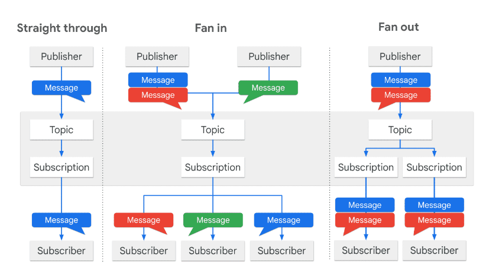
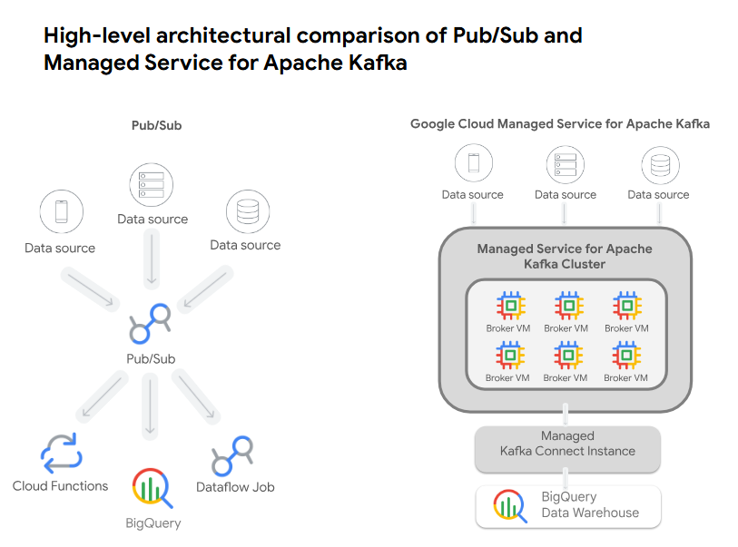
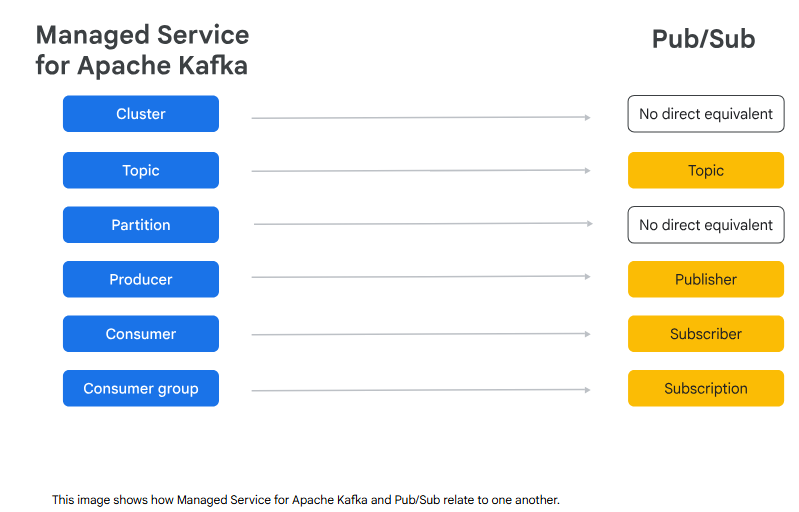

# 🚀📡 Module — Streaming Ingestion Foundations (Pub/Sub vs Managed Kafka) + Architectures + Lab (Deep Dive)

**Goal:** Pick the right **streaming ingestion layer** (Pub/Sub vs Managed Service for Apache Kafka), understand **what problems each one is designed to solve**, and know the **architectural + reliability knobs** that the **GCP Data Engineer exam** tries to catch you with.

**How to read:**

1. Why streaming → 2) Use cases & reference architectures → 3) Pub/Sub core model → 4) Pub/Sub delivery/reliability & integrations → 5) Kafka model & what it buys you → 6) Choosing + hybrid (Kafka Connect) → 7) Lab: what it teaches + why errors happened → 8) Exam cheats + quiz answers explained.

---

## 1) 🧠 Why streaming exists (first principles)

Streaming is not “batch but faster.” It’s a different operating mode:

* In **batch**, data is *at rest* (you process a file/table at a moment in time).
* In **streaming**, data is *in motion* (events keep arriving and you must keep up continuously).

So the real streaming problem is always:

### ✅ “Can you ingest and process without falling behind?”

That’s why the module highlights:

* **High velocity/volume**: if you can’t absorb bursts, you build backlog.
* **Low latency**: you need *fresh state* quickly (leaderboards, anti-cheat).
* **Ordering + correctness**: streams don’t arrive nicely sorted.
* **Elastic scaling**: load spikes must auto-scale.
* **Fault tolerance**: losing events is unacceptable.

> **Exam mental trigger:**
> If the scenario says **live**, **real-time**, **instant**, **sub-second**, **event-driven**, **leaderboard**, **anti-cheat**, **fraud detection** → you’re designing a streaming pipeline and the first question is **“what is my broker?”**

---

## 2) 🧭 Streaming use cases (the exam is testing “recognise the pattern”)

The exam usually doesn’t ask “what is streaming ETL?” — it asks a scenario and you must map it fast.

### A) **Simple Streaming ETL (Analytics fast path)**

**What it really means:** you mostly want to land events in BigQuery quickly with minimal work.

* **Broker:** Pub/Sub (common) / Kafka
* **Processing:** Dataflow optional (if tiny transforms)
* **Sink:** BigQuery
* **BI:** Looker

**Good fit when:**

* events are already structured/semi-structured
* you don’t need heavy joins/windowing/state

**Exam cue:** “ingest clickstream, query immediately in BigQuery, minimal transformation”

---

### B) **Complex Streaming ETL (Make it query-ready before BigQuery)**

**What it really means:** BigQuery is **schema-on-write** (it enforces schema), so you often need a processing layer to clean/enrich before landing.

* Join with reference data
* Validate, filter, normalise
* Aggregate in windows (per minute/session/lap)
* Reshape schema

**This is where Dataflow becomes the ‘heart’.**

**Exam cue:** “compute real-time KPIs”, “enrich with metadata”, “session stats”, “aggregation per key/time”

---

### C) **Streaming AI/ML (Online inference)**

**What it really means:** inference must happen *in the moment*, not after batch loads.

Typical shape:

* preprocess events (feature extraction)
* enrich with feature store
* call model endpoint (Vertex AI)

**Exam cue:** “real-time scoring”, “detect cheating instantly”, “fraud detection at transaction time”

---

### D) **Streaming Applications (Serving layer)**

**What it really means:** analytics storage (BigQuery) is not the same as **low-latency serving**.

* BigQuery = analytic queries (seconds, scans)
* Bigtable = serving reads (milliseconds), key-based access

So for “live leaderboards,” you often see:

* stream updates → Bigtable (serve app)
* also write to BigQuery (analytics/history)

**Exam cue:** “sub-10ms reads”, “serve live leaderboard”, “operational app needs latest state”

---

### E) **Reverse ETL (Activate analytics back into ops)**

**What it really means:** data starts in BigQuery and gets pushed outward.

* segments
* triggers
* operational profile updates

**Exam cue:** “push BigQuery insights into CRM/marketing system / operational DB”

---

## 3) 📬 Pub/Sub fundamentals (with the “real meaning”)

Pub/Sub is built to be a **serverless messaging backbone** that decouples producers and consumers.

### 3.1 The objects (and why they exist)

* **Topic** = named channel where events are published
* **Subscription** = a *delivery configuration* (and effectively a queue) attached to a topic
* **Subscriber** = code/service that receives messages

Why subscriptions matter:

* multiple subscriptions = **fan-out** (same events to multiple systems)
* each subscription can have its own:

    * delivery model (push/pull/BQ/GCS)
    * filtering rules
    * dead-letter policy
    * ack behaviour

This is the “decoupling” value: producers don’t care who consumes.

---

### 3.2 Delivery methods (push/pull/BQ/GCS) — the decision logic

#### ✅ Pull subscription

* subscriber requests messages when ready
* best when you need **backpressure control**
* typical for Dataflow streaming pipelines consuming Pub/Sub

**Use when:** you want control + high throughput + stable processing.

#### ✅ Push subscription

* Pub/Sub pushes to an HTTP endpoint
* best for serverless triggers (Cloud Functions / Cloud Run)

**Use when:** “trigger this service when message arrives”.

#### ✅ BigQuery subscription

* Pub/Sub writes messages directly to a BigQuery table

**Use when:** the main need is **simple ingestion into BigQuery without running Dataflow**.

**But**: if you need complex validation/enrichment/windowing/exactly-once pipeline behaviour, you typically move to **Pub/Sub → Dataflow → BigQuery**.

#### ✅ Cloud Storage subscription

* Pub/Sub writes to GCS files

**Use when:** you want to land raw streams as files (later batch/ML/lake usage).

---

### 3.3 Distribution patterns (straight-through, fan-in, fan-out) — why the exam cares

* **Straight-through:** simplest “one pipeline”
* **Fan-in:** multiple producers publish to one topic (central ingestion point)
* **Fan-out:** multiple subscribers consume the same topic (dashboards + ML + storage)

> **Exam reason:** This is exactly how Pub/Sub helps you build systems where you can add consumers later without touching producers.

---

## 4) 🛡️ Pub/Sub features (what turns “queue” into “platform”)

### 4.1 Integration features (what they’re really telling you)

* **BigQuery subscription** = fast analytics ingestion path
* **Dataflow** = heavy-duty processing and stronger semantics
* **Cloud Functions** = event-driven glue/automation
* **SMT (Single Message Transforms)** = lightweight tweaks without a full pipeline
* **Import topics** = managed ingestion from other clouds / Kafka / etc.

The hidden exam idea:

> Pub/Sub often plays “front door,” but **Dataflow** is where you implement correctness at scale.

---

### 4.2 Reliability features (this is exam gold)

#### ✅ At-least-once delivery (default)

Meaning: Pub/Sub can deliver the same message more than once if acking fails or the subscriber crashes.

So as an engineer you assume:

* duplicates can happen
* your processing should tolerate them (idempotency or dedupe downstream)

#### ✅ Exactly-once delivery (optional, pull subscriptions; single-region nuance)

The module states Pub/Sub can provide exactly-once delivery for pull subscriptions by using a dedup layer.

**Critical distinction (exam trap):**

* **Exactly-once delivery** means “Pub/Sub won’t redeliver after successful ack”
* It does **NOT automatically mean** “exactly-once processing” end-to-end

Because processing can fail:

* after you change state but before you ack
* or after you write to a sink but before ack
* or sink can be non-idempotent

So you still design carefully.

#### ✅ Ordering keys

Pub/Sub ordering is not “global ordering for the entire topic.”
It’s ordering **within the same ordering key**.

Tradeoff: ordering can reduce parallelism / add latency.

#### ✅ Filtering

Subscriptions can filter by attributes.
This is a scaling/cost trick: don’t deliver irrelevant messages to a consumer.

#### ✅ Dead-letter topics (DLTs)

If a subscriber keeps failing a message, Pub/Sub can send it to a dead-letter topic instead of retrying forever.

**This is the streaming equivalent of a DLQ** in batch pipelines.

---

## 5) 🧱 Kafka essentials (and why it exists as a different “shape”)

Kafka is designed as a **distributed commit log**.

### 5.1 The key concept: partitions

A Kafka topic is split into **partitions**:

* each partition is an ordered, immutable log
* order is guaranteed **within a partition**
* partitions are how Kafka scales throughput

### 5.2 Consumer groups (parallelism model)

If you have a consumer group:

* partitions are assigned to consumers
* each partition is consumed by only one consumer in the group
* gives you scaling + fault tolerance

### 5.3 Offsets (replay is native)

Consumers track offsets. This makes replay extremely natural:

* “start from offset X”
* “rewind and reprocess”

That’s why Kafka is described as a persistent log that can retain data “forever.”

---

## 6) ⚔️ Pub/Sub vs Managed Kafka (deep decision rules)

### Pick **Pub/Sub** when:

* you’re building a **new GCP-native** system
* you want **serverless/no-ops**
* you want easy integration with Dataflow/BigQuery/Functions
* you want flexible fan-out patterns quickly

### Pick **Managed Kafka** when:

* you already have Kafka producers/consumers/connectors
* you want **portability** (hybrid/multi-cloud)
* you need a **long-lived event log** with replay by offset
* your org is invested in Kafka tooling

> **High-yield exam phrase mapping:**

* “no-ops serverless ingestion” → Pub/Sub
* “existing Kafka workloads, minimal code changes” → Managed Kafka
* “replay from historical offset / persistent log” → Kafka
* “fan-out decoupling to many GCP services” → Pub/Sub

---

## 7) 🔗 Hybrid bridging (Kafka Connect) — what it buys you

You use managed Kafka Connect when:

* part of your world is Pub/Sub (cloud-native)
* part of your world is Kafka (legacy/hybrid)

Connector types:

* **Source**: Pub/Sub → Kafka (events land in Pub/Sub but legacy Kafka processors need them)
* **Sink**: Kafka → Pub/Sub (Kafka pipeline exists, but you want GCP-native consumption like Dataflow/BigQuery)

This is a very “enterprise-realistic” architecture.

---

## 8) 🧪 Lab deep recap (what it’s REALLY teaching)

### The pipeline

1. `esports-simulation.py` generates synthetic events → publishes to Pub/Sub
2. `esports-pipeline.py` launches Dataflow streaming job:

    * reads from Pub/Sub subscription
    * transforms events
    * writes to BigQuery tables:

        * `raw_events`
        * `player_score_updates`
        * `team_score_updates`
3. BigQuery views compute live leaderboards

### The SQL pattern (super testable)

They compute **latest state per entity** using:

* `ROW_NUMBER() OVER (PARTITION BY player_id ORDER BY last_updated DESC) = 1`

Then rank using:

* `RANK() OVER (ORDER BY total_score DESC)`

This pattern shows up everywhere (latest per key, slowly changing-ish streaming state snapshots).

---

### Why the WARNING happened (soft delete)

Dataflow uses GCS for:

* staging artifacts
* temp files
* shuffle/intermediate pieces

If your bucket has retention/soft-delete features, you can get:

* warnings
* unexpected costs

**Exam takeaway:** “choose the right bucket policy for temp/staging.”

---

### Why the ERROR happened (service agent + SA permissions)

Dataflow is a managed service. It uses:

* a **Dataflow service agent**
* a **worker service account**

If the service agent cannot “act on” / access the worker SA, Dataflow can’t start workers.

Lab fix: grant **Cloud Dataflow Service Agent** role on the compute worker SA.

**Exam takeaway:** Dataflow failures at start are often **IAM/service agent** misconfigurations.

---

## 9) ✅ Quiz answers

### Quiz 1 — Q1: Pub/Sub advantages (select all that apply)

✅ Correct:

* **Integrates with many GCP services without extra connectors**
* **Fully managed “no-ops” (no cluster management)**
* **Completely serverless + pay-for-what-you-use**

❌ Incorrect:

* **Long-term message persistence with replay from any historical offset** → Kafka advantage
* **Strict ordering across all messages in a topic without throughput impact** → wrong; Pub/Sub ordering is by ordering key and can affect latency/parallelism

---

### Quiz 1 — Q2: Key benefit of Managed Service for Apache Kafka

✅ Correct:

* **Automates complex operational tasks like broker sizing and rebalancing**

❌ Incorrect:

* “No Kafka API knowledge needed” → you still use Kafka concepts
* “Completely serverless with no cluster config” → not how it’s positioned

---

### Quiz 1 — Q3: Pub/Sub exactly-once processing without idempotent logic

✅ **False**

Reason:

* Pub/Sub can provide **exactly-once delivery** in specific conditions
* but **end-to-end processing** can still duplicate if failures occur around acking/writing
* so you still design idempotent/duplicate-tolerant processing in real pipelines

> This is one of the most common “wording traps” on the exam: delivery vs processing.

---

## 10) 🔥 The exam “decision spine” (memorise this)

* **Need cloud-native ingestion + no ops + fan-out** → **Pub/Sub**
* **Need Kafka portability + offsets + long replay** → **Managed Kafka**
* **Need complex transformations / enrichment / windowing** → **Dataflow**
* **Need analytics querying + dashboards** → **BigQuery**
* **Need low-latency serving state (leaderboards)** → **Bigtable**
* **Need poison message handling** → **Dead-letter topic**
* **Need ordering** → Pub/Sub ordering keys or Kafka partitioning strategy